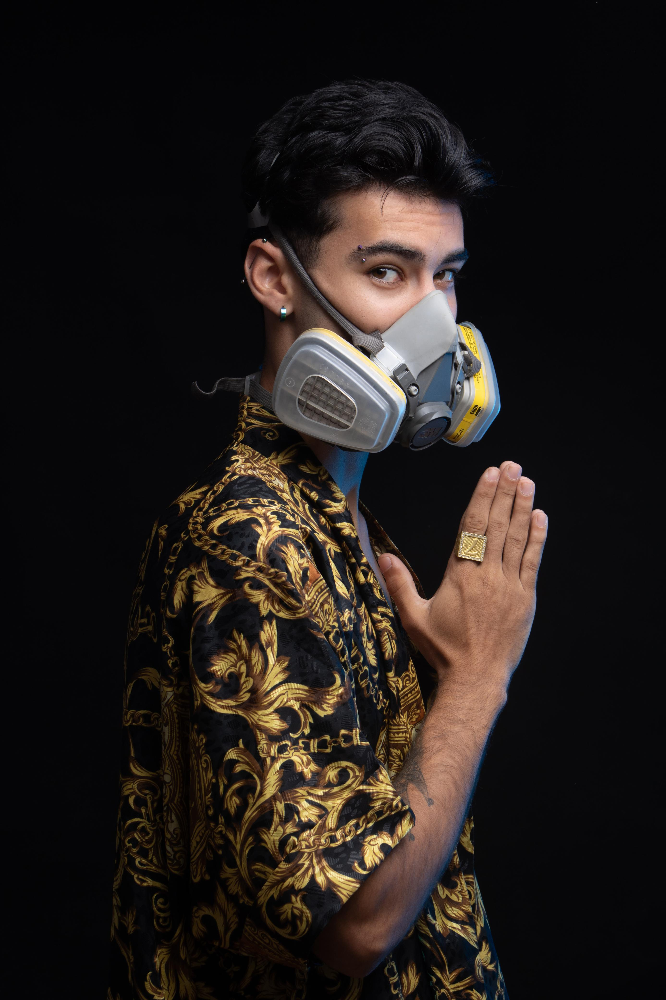

-----

-----

<table>
<tr>
 <td align="center" colspan="11"></td>
</tr> 
<tr>
<td>
</td>
<td>
</td>
<td>
</td>
<td>
</td>
<td>
</td>
<td>
</td>
</tr>
<tr>
 <td align="center" colspan="11"></td>
</tr> 
</table>

<i><b>Olá</b> :wave:, sou o <code>Brian</code>, tenho 20 anos, moro em BH e estudo programação desde os 18 anos de idade. Atualmente sou  <code>Desenvolvedor</code> e cursando Engenharia de Software na <a href="https://www.pucminas.br/" target="_blank">PUC Minas</a>.</i> :man_teacher: 

-----
Sobre mim:

Sou o <code>Brian</code>, um jovem determinado e sociável, com facilidade de comunicação e liderança de equipe. Desde cedo, desenvolvi habilidades de gestão de processos e relacionamento interpessoal, trabalhando em áreas como vendas e atendimento ao público e indústria metalúrgica, onde aprimorei a gestão de equipes e a análise de processos.

Minha paixão pela música me impulsionou a me tornar DJ e produtor musical aos 16 anos, demonstrando minha criatividade e capacidade de aprender rápido.

&nbsp;<a href="https://allmylinks.com/djbrianbr" target="_blank"> Clique aqui para conhecer mais!!! </a>:headphones: 

A programação me fascinou desde os 17 anos, mas a falta de recursos me impediu de mergulhar de cabeça nesse universo. Com persistência, aos 18 anos, adquiri meu próprio computador e me dediquei a cursos online para aprimorar minhas habilidades. Agora, como estudante de Engenharia de Software, busco uma formação sólida para me destacar na área, combinando meu interesse em tecnologia com a experiência em gestão e desenvolvimento.

Essa combinação de habilidades e paixão me torna um profissional versátil e dedicado, pronto para contribuir para o sucesso de qualquer equipe.

Gostaria de ter a oportunidade de mostrar meu potencial e contribuir para o seu projeto!

-----

Meus interesses pessoais:

<table>
<tr>
 <td align="center" colspan="2"></td>
</tr> 
<tr>
<td>

 

- :man_teacher: Engenharia de software na <a href="https://www.pucminas.br/" target="_blank">PUC Minas</a>

- :mortar_board: Aprofundar estudos em analise de dados e websegurança

 - :necktie:  Autoconhecimento e estudos esotéricos     
 
 - :airplane: Conhecer as maiores belezas naturais pela terra
 
- :briefcase: Em busca do primeiro emprego na área da tecnologia 

- :trophy: Adoro vôlei, já joguei jeng de handbol pelo time da escola e também gosto de jogos eletrônicos 

- :atom: Amo conversar sobre astrologia, curiosidades e conexões do universo, historias e acontecimentos mistícos e tudo relacionado as energias e relações da vida

- :books: Voltando a estabelecer o habito de leitura com livros voltado para estudos de espiritualidade 

- :soccer: Sou atleticano, torço para o <a href="https://www.arenamrv.com.br/" target="_blank">galo doido</a>. :rooster:
 
- :tv: Meu anime preferido chama-se One piece 

- :speech_balloon:Gosto de conversa e conhecer todo tipo de pessoa, pois cada pessoa carrega uma história única    

- :mailbox: Para me encontrar, este é meu <a href="mailto:brederbrian@gmail.com" target="_blank">e-mail</a> pessoal e este é meu <a href="mailto:bbfelix@pucminas.br" target="_blank">e-email</a> corporativo da PUC Minas.

- :calendar: 15/07/2004 &#127812;

</td>
<td>

</td>
</tr>
<tr>
 <td align="center" colspan="2"></td>
</tr> 
</table>

-----

&nbsp;Linguagens e ferramentas:

&nbsp; 
<code></code>
&nbsp; 
<code></code>
&nbsp; 
<code></code>
&nbsp; 
<code></code>
&nbsp; 
<code></code>
&nbsp; 
<code></code>
&nbsp; 
<code></code>
&nbsp;
<code></code>
&nbsp;
<code></code>
&nbsp;
<code></code>
&nbsp;
<code></code>
&nbsp;
<code></code>
&nbsp; 
<code></code>
&nbsp; 
<code></code>
&nbsp; 
<code></code>
&nbsp; 
<code></code>
&nbsp; 
<code></code>
&nbsp; 
<code></code>
&nbsp; 
<code></code>
&nbsp; 
<code></code>
&nbsp; 
<code></code>
&nbsp;
<code></code>
&nbsp;
<code></code>
&nbsp;
<code></code>
&nbsp;
<code></code>
&nbsp; 
<code></code>
&nbsp; 
<code></code>
&nbsp; 
<code></code>
&nbsp; 
<code></code>
&nbsp; 
<code></code>
&nbsp; 
<code></code>
&nbsp; 
<code></code>
&nbsp; 
<code></code>
&nbsp; 
<code></code>
&nbsp; 
<code></code>
&nbsp;
<code></code>
&nbsp;
<code></code>
&nbsp;
<code></code>
&nbsp; 
<code></code>
&nbsp; 
<code></code>
&nbsp; 
<code></code>
&nbsp; 
<code></code>
&nbsp;
<code></code>
&nbsp;
<code></code>
&nbsp;
<code></code>

-----